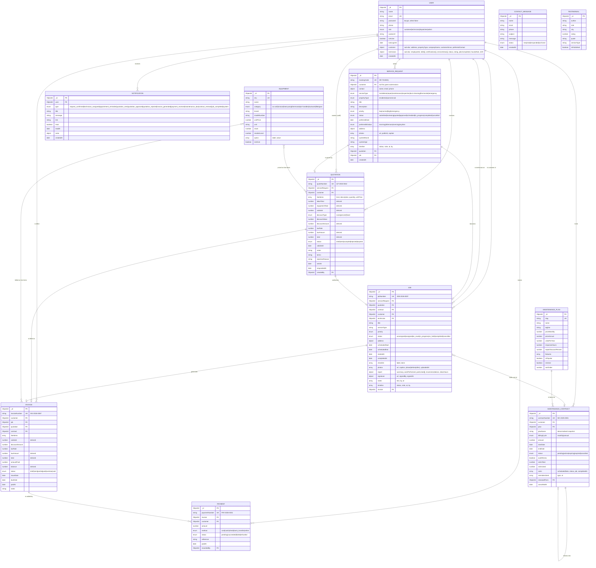
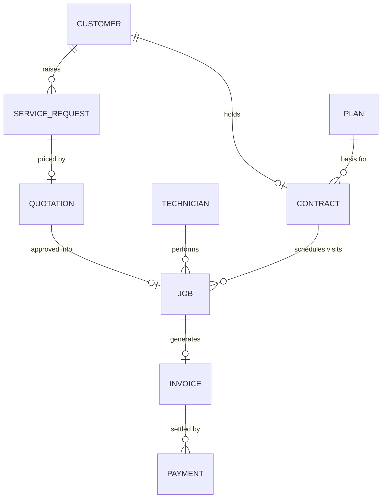

# Entity Relationship Diagram

ServiceFlow — ArcticAir HVAC Solutions

Rendered with Mermaid. GitHub displays these natively; VS Code needs the Markdown Preview Mermaid
extension.

---

## Full ER diagram

---

## Simplified core relationships

The commercial spine of the system, stripped of supporting entities:

---

## Cardinality notes

| Relationship | Cardinality | Rationale |
| --- | --- | --- |
| Service request → Quotation | 1 : 0..1 | One live estimate per request. A rejected quote is superseded by a new request, keeping the audit trail honest. |
| Quotation → Job | 1 : 0..1 | A job is only created once the customer approves. |
| Job → Invoice | 1 : 0..1 | Guarded server-side: `createInvoice` rejects a job that already carries an invoice. |
| Invoice → Payment | 1 : 0..n | Partial payments are first-class; the balance is recomputed on every write. |
| Customer → Contract | 1 : 0..n over time, 1 : 0..1 live | `createContract` rejects a second `active`/`expiring` contract for the same customer. |
| Contract → Contract | 1 : 0..1 | `renewedFrom` chains renewal history without duplicating the record. |
| Job → Technician | 0..1 : 1 | A job can sit unassigned in the dispatch queue. Overlapping assignments are rejected with `409`. |

## Denormalisation decisions

Three fields are deliberately duplicated:

- **`MaintenanceContract.planName`** — a snapshot of the plan name at signing. If the plan is later
  renamed or repriced, historical contracts still say what the customer actually bought.
- **`Job.address`** and **`Job.serviceType`** — copied from the service request so the technician's
  view needs no join, and so an address correction on a later request never rewrites the record of
  where someone was actually sent.
- **`ServiceRequest.contact`** — captured at submission, because a guest may not have an account and
  a customer may later change their profile details.
