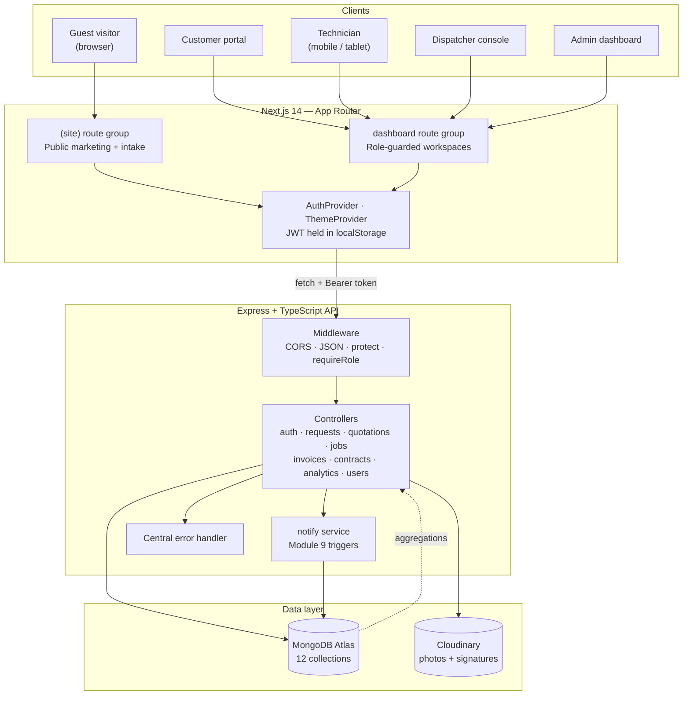
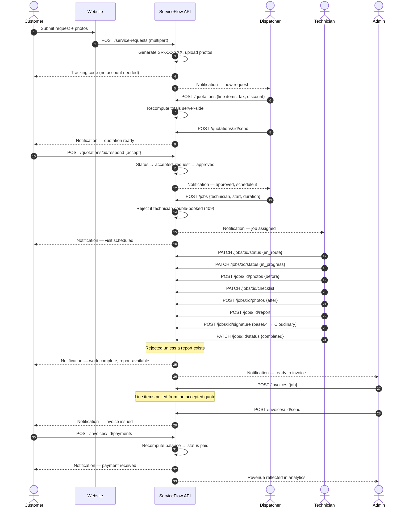
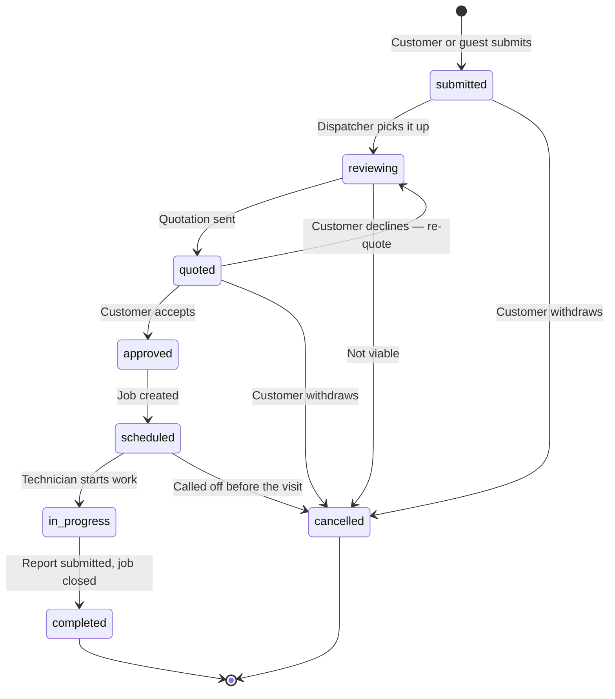
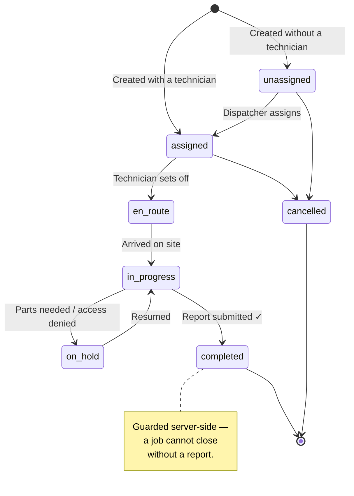
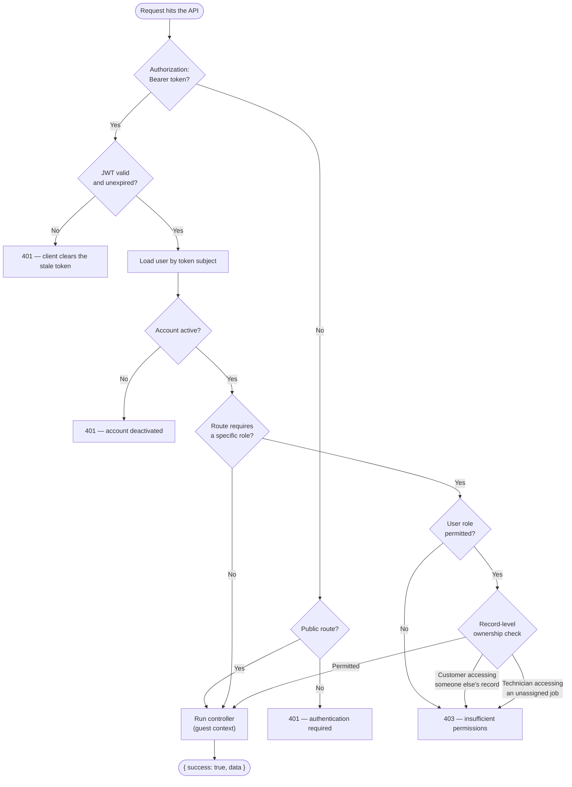
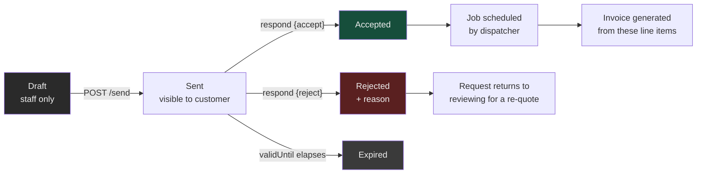
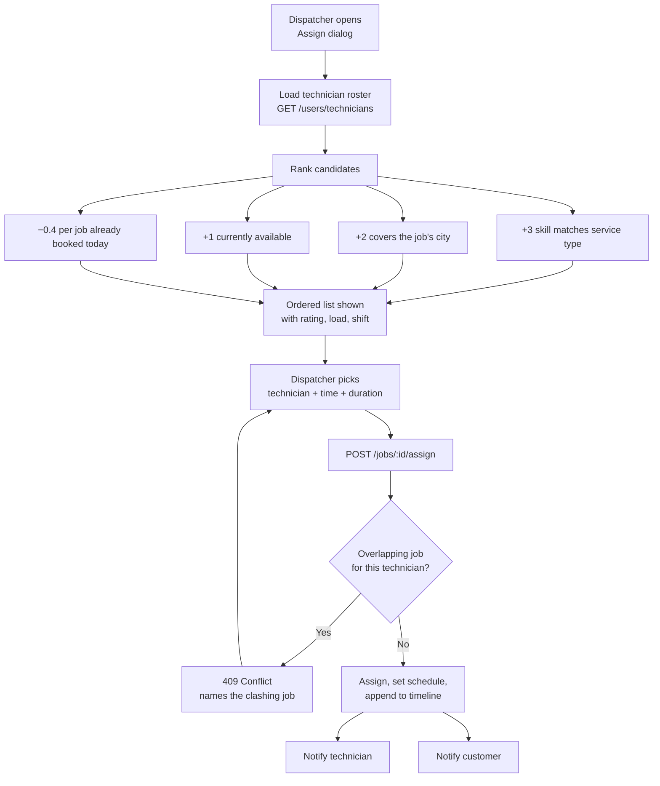
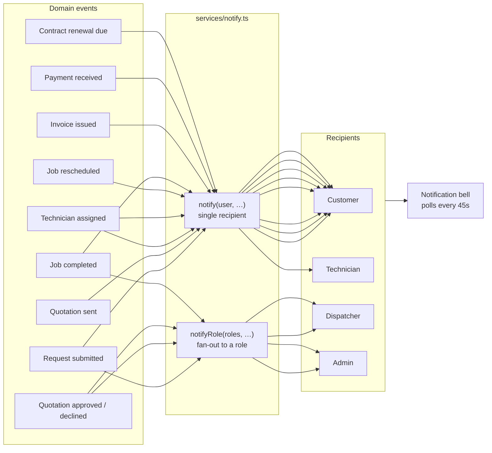

# System Flow Diagrams

ServiceFlow — ArcticAir HVAC Solutions

---

## 1. System architecture

---

## 2. End-to-end service lifecycle

The path a single job takes from enquiry to cash, showing which role acts at each step.

---

## 3. Service request state machine

## 4. Job state machine

---

## 5. Authentication and authorisation

Route guards live in two places, deliberately:

- **`middleware/auth.ts`** — `protect` and `requireRole` handle coarse access (is this a dispatcher?).
- **Inside each controller** — record-level ownership (is this *your* invoice?). Keeping this in the
  controller means the check sits next to the query that loaded the document, where it cannot be
  forgotten.

---

## 6. Quotation approval flow

Once a customer has responded, the quotation becomes immutable — `updateQuotation` rejects edits to
anything in `accepted` or `rejected`. That keeps the document a faithful record of what was actually
agreed.

---

## 7. Dispatcher assignment logic

The ranking is a client-side convenience — the authoritative double-booking check runs on the
server, so it holds regardless of what the UI suggested.

---

## 8. Notification triggers (Module 9)

Every trigger funnels through one module. That is the single seam where an email or SMS provider
would be attached — no controller would need to change.

---

## 9. Site map

```mermaid
flowchart TD
    root["/"] --> pub["Public site"]
    root --> auth["Authentication"]
    root --> dash["Dashboards"]

    pub --> p1["/services"]
    pub --> p2["/maintenance-plans"]
    pub --> p3["/service-areas"]
    pub --> p4["/about"]
    pub --> p5["/testimonials"]
    pub --> p6["/emergency"]
    pub --> p7["/faq"]
    pub --> p8["/contact"]
    pub --> p9["/request-quote"]
    pub --> p10["/track"]

    auth --> a1["/login"]
    auth --> a2["/register"]

    dash --> cu["/dashboard/customer"]
    dash --> te["/dashboard/technician"]
    dash --> di["/dashboard/dispatcher"]
    dash --> ad["/dashboard/admin"]

    cu --> cu1["requests · requests/:id"]
    cu --> cu2["quotations · quotations/:id"]
    cu --> cu3["invoices · invoices/:id"]
    cu --> cu4["contracts"]
    cu --> cu5["profile"]

    te --> te1["jobs/:id"]
    te --> te2["schedule"]
    te --> te3["history"]
    te --> te4["profile"]

    di --> di1["schedule"]
    di --> di2["requests · requests/:id"]
    di --> di3["technicians"]
    di --> di4["quotations"]

    ad --> ad1["requests"]
    ad --> ad2["quotations"]
    ad --> ad3["invoices · invoices/:id"]
    ad --> ad4["contracts"]
    ad --> ad5["customers · customers/:id"]
    ad --> ad6["technicians"]
    ad --> ad7["equipment"]
    ad --> ad8["plans"]
    ad --> ad9["messages"]
```

